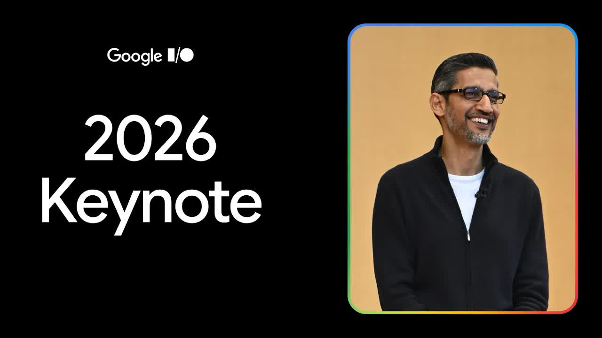

# Google-I⧸O-'26-Keynote

  <picture>
    
  </picture>

 

---

## Video Information

| Property | Value |
|----------|-------|
| **Video Name** | `Google-I⧸O-'26-Keynote` |
| **Original Link** | [YouTube Video](https://www.youtube.com/watch?v=wYSncx9zLIU) |
| **Total Size** | **9 parts** - **404.48 MB** |
| **Quality** | **720** |
| **Status** | **Complete (100%)** |
| **Password Protected** | **NO** |

---

---

## 🔤 Subtitles

| # | File | Link |
|---|------|------|
| 1 | `subtitle.zip` | [Download](https://raw.githubusercontent.com/emmawolga/TB/main/videos/Google-I%E2%A7%B8O-%2726-Keynote/subtitle.zip) |

> Contains all available subtitle languages. Extract to get `.vtt` files.

## Download Links

> ⬇️ Download **all parts**, then open `Google-I⧸O-'26-Keynote.zip` — the other parts are found automatically.

| # | File | Link |
|---|------|------|
| 1 | `Google-I⧸O-'26-Keynote.z01` | [Download](https://raw.githubusercontent.com/emmawolga/TB/main/videos/Google-I%E2%A7%B8O-%2726-Keynote/Google-I%E2%A7%B8O-%2726-Keynote.z01) |
| 2 | `Google-I⧸O-'26-Keynote.z02` | [Download](https://raw.githubusercontent.com/emmawolga/TB/main/videos/Google-I%E2%A7%B8O-%2726-Keynote/Google-I%E2%A7%B8O-%2726-Keynote.z02) |
| 3 | `Google-I⧸O-'26-Keynote.z03` | [Download](https://raw.githubusercontent.com/emmawolga/TB/main/videos/Google-I%E2%A7%B8O-%2726-Keynote/Google-I%E2%A7%B8O-%2726-Keynote.z03) |
| 4 | `Google-I⧸O-'26-Keynote.z04` | [Download](https://raw.githubusercontent.com/emmawolga/TB/main/videos/Google-I%E2%A7%B8O-%2726-Keynote/Google-I%E2%A7%B8O-%2726-Keynote.z04) |
| 5 | `Google-I⧸O-'26-Keynote.z05` | [Download](https://raw.githubusercontent.com/emmawolga/TB/main/videos/Google-I%E2%A7%B8O-%2726-Keynote/Google-I%E2%A7%B8O-%2726-Keynote.z05) |
| 6 | `Google-I⧸O-'26-Keynote.z06` | [Download](https://raw.githubusercontent.com/emmawolga/TB/main/videos/Google-I%E2%A7%B8O-%2726-Keynote/Google-I%E2%A7%B8O-%2726-Keynote.z06) |
| 7 | `Google-I⧸O-'26-Keynote.z07` | [Download](https://raw.githubusercontent.com/emmawolga/TB/main/videos/Google-I%E2%A7%B8O-%2726-Keynote/Google-I%E2%A7%B8O-%2726-Keynote.z07) |
| 8 | `Google-I⧸O-'26-Keynote.z08` | [Download](https://raw.githubusercontent.com/emmawolga/TB/main/videos/Google-I%E2%A7%B8O-%2726-Keynote/Google-I%E2%A7%B8O-%2726-Keynote.z08) |
| 9 | `Google-I⧸O-'26-Keynote.zip` | [Download](https://raw.githubusercontent.com/emmawolga/TB/main/videos/Google-I%E2%A7%B8O-%2726-Keynote/Google-I%E2%A7%B8O-%2726-Keynote.zip) |

---

## How to Extract

Download all parts into the **same folder**, then:

| OS | Steps |
|----|-------|
| **Windows** | Double-click `Google-I⧸O-'26-Keynote.zip` — opens in Explorer, WinRAR, or 7-Zip automatically |
| **Mac** | Double-click `Google-I⧸O-'26-Keynote.zip` — extracts with Archive Utility or The Unarchiver |
| **Linux** | `unzip Google-I⧸O-'26-Keynote.zip` or right-click → Extract Here (Ark/File Manager) |
| **Android** | Tap `Google-I⧸O-'26-Keynote.zip` in your file manager — or use [ZArchiver](https://play.google.com/store/apps/details?id=ru.zdevs.zarchiver) |

---

*This tool created by *
