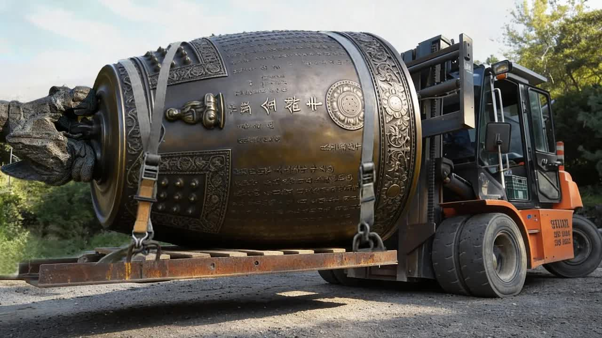

# How-a-5-Ton-Temple-Bell-Is-Forged-to-Ring-for-1,000-Years-｜-by-@kingprocess

  <picture>
    
  </picture>

 

---

## Video Information

| Property | Value |
|----------|-------|
| **Video Name** | `How-a-5-Ton-Temple-Bell-Is-Forged-to-Ring-for-1,000-Years-｜-by-@kingprocess` |
| **Original Link** | [YouTube Video](https://www.youtube.com/watch?v=SrF3ewmBTUI&pp=ugUEEgJlbg%3D%3D) |
| **Total Size** | **5 parts** - **223.99 MB** |
| **Quality** | **720** |
| **Status** | **Complete (100%)** |
| **Password Protected** | **NO** |

---

## Download Links

> ⬇️ Download **all parts**, then open `How-a-5-Ton-Temple-Bell-Is-Forged-to-Ring-for-1,000-Years-｜-by-@kingprocess.zip` — the other parts are found automatically.

| # | File | Link |
|---|------|------|
| 1 | `How-a-5-Ton-Temple-Bell-Is-Forged-to-Ring-for-1,000-Years-｜-by-@kingprocess.z01` | [Download](https://raw.githubusercontent.com/emmawolga/TB/main/videos/How-a-5-Ton-Temple-Bell-Is-Forged-to-Ring-for-1%2C000-Years-%EF%BD%9C-by-%40kingprocess/How-a-5-Ton-Temple-Bell-Is-Forged-to-Ring-for-1%2C000-Years-%EF%BD%9C-by-%40kingprocess.z01) |
| 2 | `How-a-5-Ton-Temple-Bell-Is-Forged-to-Ring-for-1,000-Years-｜-by-@kingprocess.z02` | [Download](https://raw.githubusercontent.com/emmawolga/TB/main/videos/How-a-5-Ton-Temple-Bell-Is-Forged-to-Ring-for-1%2C000-Years-%EF%BD%9C-by-%40kingprocess/How-a-5-Ton-Temple-Bell-Is-Forged-to-Ring-for-1%2C000-Years-%EF%BD%9C-by-%40kingprocess.z02) |
| 3 | `How-a-5-Ton-Temple-Bell-Is-Forged-to-Ring-for-1,000-Years-｜-by-@kingprocess.z03` | [Download](https://raw.githubusercontent.com/emmawolga/TB/main/videos/How-a-5-Ton-Temple-Bell-Is-Forged-to-Ring-for-1%2C000-Years-%EF%BD%9C-by-%40kingprocess/How-a-5-Ton-Temple-Bell-Is-Forged-to-Ring-for-1%2C000-Years-%EF%BD%9C-by-%40kingprocess.z03) |
| 4 | `How-a-5-Ton-Temple-Bell-Is-Forged-to-Ring-for-1,000-Years-｜-by-@kingprocess.z04` | [Download](https://raw.githubusercontent.com/emmawolga/TB/main/videos/How-a-5-Ton-Temple-Bell-Is-Forged-to-Ring-for-1%2C000-Years-%EF%BD%9C-by-%40kingprocess/How-a-5-Ton-Temple-Bell-Is-Forged-to-Ring-for-1%2C000-Years-%EF%BD%9C-by-%40kingprocess.z04) |
| 5 | `How-a-5-Ton-Temple-Bell-Is-Forged-to-Ring-for-1,000-Years-｜-by-@kingprocess.zip` | [Download](https://raw.githubusercontent.com/emmawolga/TB/main/videos/How-a-5-Ton-Temple-Bell-Is-Forged-to-Ring-for-1%2C000-Years-%EF%BD%9C-by-%40kingprocess/How-a-5-Ton-Temple-Bell-Is-Forged-to-Ring-for-1%2C000-Years-%EF%BD%9C-by-%40kingprocess.zip) |

---

## How to Extract

Download all parts into the **same folder**, then:

| OS | Steps |
|----|-------|
| **Windows** | Double-click `How-a-5-Ton-Temple-Bell-Is-Forged-to-Ring-for-1,000-Years-｜-by-@kingprocess.zip` — opens in Explorer, WinRAR, or 7-Zip automatically |
| **Mac** | Double-click `How-a-5-Ton-Temple-Bell-Is-Forged-to-Ring-for-1,000-Years-｜-by-@kingprocess.zip` — extracts with Archive Utility or The Unarchiver |
| **Linux** | `unzip How-a-5-Ton-Temple-Bell-Is-Forged-to-Ring-for-1,000-Years-｜-by-@kingprocess.zip` or right-click → Extract Here (Ark/File Manager) |
| **Android** | Tap `How-a-5-Ton-Temple-Bell-Is-Forged-to-Ring-for-1,000-Years-｜-by-@kingprocess.zip` in your file manager — or use [ZArchiver](https://play.google.com/store/apps/details?id=ru.zdevs.zarchiver) |

---

*This tool created by *
