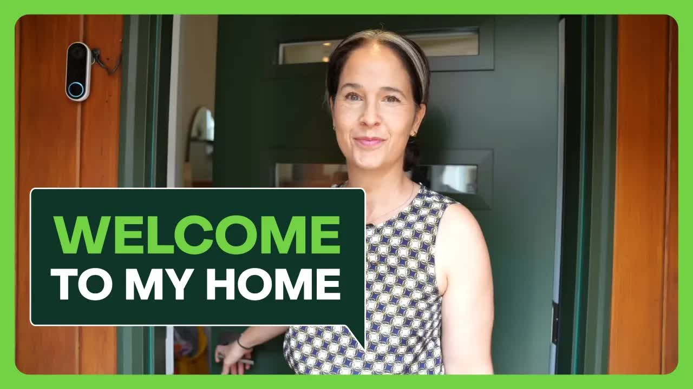

# What-Does-My-House-Look-Like-Inside？-I’ll-Show-You!-Speaking-English-Lesson：-Vocabulary-At-Home

  <picture>
    
  </picture>

 

---

## Video Information

| Property | Value |
|----------|-------|
| **Video Name** | `What-Does-My-House-Look-Like-Inside？-I’ll-Show-You!-Speaking-English-Lesson：-Vocabulary-At-Home` |
| **Original Link** | [YouTube Video](https://www.youtube.com/watch?v=MafOjGrTgd0) |
| **Total Size** | **6 parts** - **253.17 MB** |
| **Quality** | **720** |
| **Status** | **Complete (100%)** |
| **Password Protected** | **NO** |

---

---

## 🔤 Subtitles

| # | File | Link |
|---|------|------|
| 1 | `subtitle.zip` | [Download](https://raw.githubusercontent.com/emmawolga/TB/main/videos/What-Does-My-House-Look-Like-Inside%EF%BC%9F-I%E2%80%99ll-Show-You%21-Speaking-English-Lesson%EF%BC%9A-Vocabulary-At-Home/subtitle.zip) |

> Contains all available subtitle languages. Extract to get `.vtt` files.

## Download Links

> ⬇️ Download **all parts**, then open `What-Does-My-House-Look-Like-Inside？-I’ll-Show-You!-Speaking-English-Lesson：-Vocabulary-At-Home.zip` — the other parts are found automatically.

| # | File | Link |
|---|------|------|
| 1 | `What-Does-My-House-Look-Like-Inside？-I’ll-Show-You!-Speaking-English-Lesson：-Vocabulary-At-Home.z01` | [Download](https://raw.githubusercontent.com/emmawolga/TB/main/videos/What-Does-My-House-Look-Like-Inside%EF%BC%9F-I%E2%80%99ll-Show-You%21-Speaking-English-Lesson%EF%BC%9A-Vocabulary-At-Home/What-Does-My-House-Look-Like-Inside%EF%BC%9F-I%E2%80%99ll-Show-You%21-Speaking-English-Lesson%EF%BC%9A-Vocabulary-At-Home.z01) |
| 2 | `What-Does-My-House-Look-Like-Inside？-I’ll-Show-You!-Speaking-English-Lesson：-Vocabulary-At-Home.z02` | [Download](https://raw.githubusercontent.com/emmawolga/TB/main/videos/What-Does-My-House-Look-Like-Inside%EF%BC%9F-I%E2%80%99ll-Show-You%21-Speaking-English-Lesson%EF%BC%9A-Vocabulary-At-Home/What-Does-My-House-Look-Like-Inside%EF%BC%9F-I%E2%80%99ll-Show-You%21-Speaking-English-Lesson%EF%BC%9A-Vocabulary-At-Home.z02) |
| 3 | `What-Does-My-House-Look-Like-Inside？-I’ll-Show-You!-Speaking-English-Lesson：-Vocabulary-At-Home.z03` | [Download](https://raw.githubusercontent.com/emmawolga/TB/main/videos/What-Does-My-House-Look-Like-Inside%EF%BC%9F-I%E2%80%99ll-Show-You%21-Speaking-English-Lesson%EF%BC%9A-Vocabulary-At-Home/What-Does-My-House-Look-Like-Inside%EF%BC%9F-I%E2%80%99ll-Show-You%21-Speaking-English-Lesson%EF%BC%9A-Vocabulary-At-Home.z03) |
| 4 | `What-Does-My-House-Look-Like-Inside？-I’ll-Show-You!-Speaking-English-Lesson：-Vocabulary-At-Home.z04` | [Download](https://raw.githubusercontent.com/emmawolga/TB/main/videos/What-Does-My-House-Look-Like-Inside%EF%BC%9F-I%E2%80%99ll-Show-You%21-Speaking-English-Lesson%EF%BC%9A-Vocabulary-At-Home/What-Does-My-House-Look-Like-Inside%EF%BC%9F-I%E2%80%99ll-Show-You%21-Speaking-English-Lesson%EF%BC%9A-Vocabulary-At-Home.z04) |
| 5 | `What-Does-My-House-Look-Like-Inside？-I’ll-Show-You!-Speaking-English-Lesson：-Vocabulary-At-Home.z05` | [Download](https://raw.githubusercontent.com/emmawolga/TB/main/videos/What-Does-My-House-Look-Like-Inside%EF%BC%9F-I%E2%80%99ll-Show-You%21-Speaking-English-Lesson%EF%BC%9A-Vocabulary-At-Home/What-Does-My-House-Look-Like-Inside%EF%BC%9F-I%E2%80%99ll-Show-You%21-Speaking-English-Lesson%EF%BC%9A-Vocabulary-At-Home.z05) |
| 6 | `What-Does-My-House-Look-Like-Inside？-I’ll-Show-You!-Speaking-English-Lesson：-Vocabulary-At-Home.zip` | [Download](https://raw.githubusercontent.com/emmawolga/TB/main/videos/What-Does-My-House-Look-Like-Inside%EF%BC%9F-I%E2%80%99ll-Show-You%21-Speaking-English-Lesson%EF%BC%9A-Vocabulary-At-Home/What-Does-My-House-Look-Like-Inside%EF%BC%9F-I%E2%80%99ll-Show-You%21-Speaking-English-Lesson%EF%BC%9A-Vocabulary-At-Home.zip) |

---

## How to Extract

Download all parts into the **same folder**, then:

| OS | Steps |
|----|-------|
| **Windows** | Double-click `What-Does-My-House-Look-Like-Inside？-I’ll-Show-You!-Speaking-English-Lesson：-Vocabulary-At-Home.zip` — opens in Explorer, WinRAR, or 7-Zip automatically |
| **Mac** | Double-click `What-Does-My-House-Look-Like-Inside？-I’ll-Show-You!-Speaking-English-Lesson：-Vocabulary-At-Home.zip` — extracts with Archive Utility or The Unarchiver |
| **Linux** | `unzip What-Does-My-House-Look-Like-Inside？-I’ll-Show-You!-Speaking-English-Lesson：-Vocabulary-At-Home.zip` or right-click → Extract Here (Ark/File Manager) |
| **Android** | Tap `What-Does-My-House-Look-Like-Inside？-I’ll-Show-You!-Speaking-English-Lesson：-Vocabulary-At-Home.zip` in your file manager — or use [ZArchiver](https://play.google.com/store/apps/details?id=ru.zdevs.zarchiver) |

---

*This tool created by *
